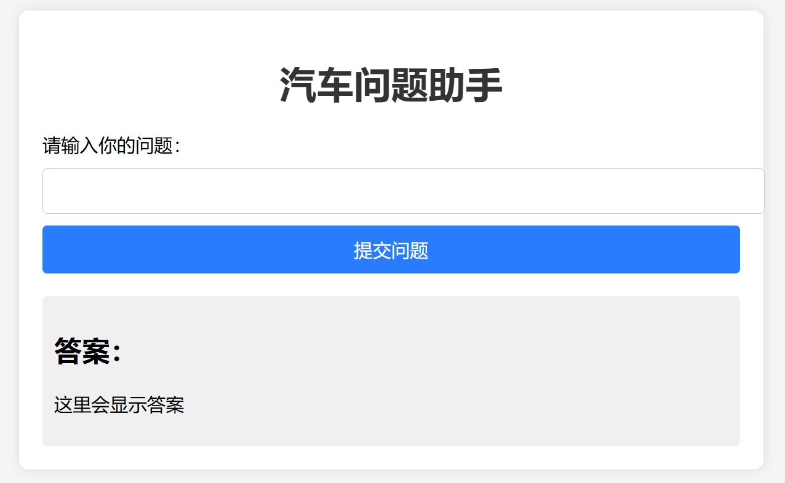

# RAG Demo: Automotive Q&A System

This project implements a Retrieval-Augmented Generation (RAG) demo, creating a question-answering system designed to answer automotive-related queries. The system uses **ChatGLM** to locate relevant information in documents and generate corresponding answers based on the content extracted from `.pdf` files.

## Workflow

File Reading → Text Segmentation → Single-Path Retrieval → Multi-Path Retrieval Fusion → Re-ranking → Prompt Generation and Question-Answering → Output

It's really more of a standard process demo based on the RAG approach. In a real-world application, many aspects would need further improvement.

## Usage
To generate a complete `.json` file for the entire query dataset, simply run `RAG.py`. For testing with a smaller dataset, replace `question.json` with `questionsmall.json`. This will allow you to observe the system's functionality in action with a reduced dataset. Reference content and pages are also generated for review.

The files in the subfolders contain fundamental functions separated from the main `RAG.py` script and can be used as tutorials. These functions can be executed individually under the instruction of `note.py`. All necessary data files are included in each subfolder, so there’s no need to adjust file paths.

If you replace the `.pdf` file, please note that `pdfplumber` module can only process **text-based `.pdf`**.


## Frontend Interaction
To start the frontend interaction, navigate to the `backend` folder and run:

```bash
python app.py
```

Once the server is running, open your browser and visit `http://127.0.0.1:5000/` to interact with the system and perform question-answering tasks.





## Acknowledgements

The Coggle community provides valuable tutorials and resources. More can be explored from the community at [Coggle Club Notebooks](https://github.com/coggle-club/notebooks).

